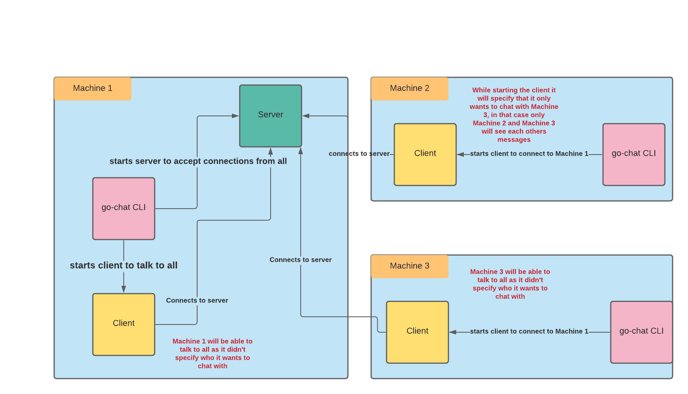

# go-chat
go-chat is a gRPC based chat CLI written in golang for command line lovers. This CLI allows you to chat
with your friends without leaving the command line.

## Installation

This CLI was built with go 1.17.
```shell
go install github.com/piyushjajoo/go-chat@latest
```

If you have an older version of go, go install might not work. Try following command -
```shell
export GO111MODULE=on
go get github.com/piyushjajoo/go-chat@latest
go install github.com/piyushjajoo/go-chat
export PATH=$PATH:$GOPATH/bin
```

### Go chat help
```
$ go-chat 
go-chat is an interactive gRPC based command line chat application. This application
allows you to chat with anyone in the world securely through command line, so you never have to leave
your terminal.

NOTE: this doesn't persist any messages, so feel free to be anonymous.'

Usage:
  go-chat [command]

Available Commands:
  completion  generate the autocompletion script for the specified shell
  help        Help about any command
  server      server starts the chat server for you
  with        with sub-command let's you specify who you want to chat with

Flags:
      --config string   config file (default is $HOME/.go-chat.yaml)
  -h, --help            help for go-chat

Use "go-chat [command] --help" for more information about a command.
```

## Start the server
```shell
go-chat server --port 8080
```

### Go chat `server` sub-command help

```
$ go-chat server --help
server allows you to start your own chat server and that way you can allow others to chat with you.
The server doesn't store any messages so never worry while using this in your terminal'

Usage:
  go-chat server [flags]

Flags:
  -h, --help          help for server
  -p, --port string   Port on which you want to start the server, default 8080 (default "8080")

Global Flags:
      --config string   config file (default is $HOME/.go-chat.yaml)

```

## Connect clients and chat
```shell
go-chat with --remove-server-host localhost:8080 --name Piyush --chatting-with Jon,Jim
```

### Go chat `with` sub-command help

```
$ go-chat with --help
with sub-command let's you specify who you chat with

Usage:
  go-chat with [flags]

Flags:
  -c, --chatting-with string        comma separated list of users names on the remote host you want to chat with e.g. A,B,C, default is you can chat with all (default "all")
  -h, --help                        help for with
  -n, --name string                 your display name you want users to see e.g. Piyush
  -s, --remove-server-host string   Remote server host where you want to join chat e.g 10.11.12.13:8080, default is localhost (default "localhost:8080")

Global Flags:
      --config string   config file (default is $HOME/.go-chat.yaml)
```

## How it works

* server sub-command starts the grpc server on the provided port and accepts connections from everywhere.
* with sub-command starts the grpc stub/client and tries to connect to the provided remote host.
* once the client establishes the connection with remote server, client will be able to broadcast 
  messages to all (by default) or selected users.
* server makes sure that only those users receive/send the messages who are allowed by client while connecting.



## Further improvements
1. Allow secure communication between client and server.
2. Provide an option to back up chat messages.
3. Improve command line user experience.
4. Allow multiple users with same name.
